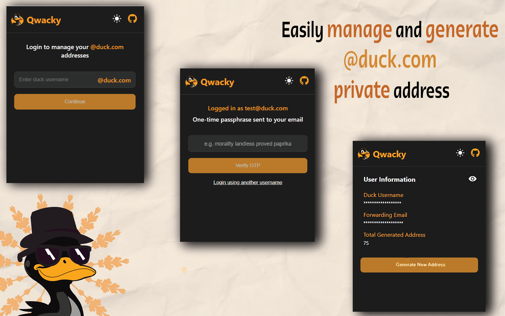

<p align="center">
  
</p>

<p align="center">
<a href="#-why-qwacky">Why Qwacky?</a>&nbsp;&nbsp;&bull;&nbsp;&nbsp;<a href="#-download">Download</a>&nbsp;&nbsp;&bull;&nbsp;&nbsp;<a href="#-features">Features</a>&nbsp;&nbsp;&bull;&nbsp;&nbsp;<a href="#-screenshots">Screenshots</a>&nbsp;&nbsp;&bull;&nbsp;&nbsp;<a href="#-security--privacy">Security & Privacy</a>&nbsp;&nbsp;&bull;&nbsp;&nbsp;<a href="#️-manual-installation">Manual Installation</a>&nbsp;&nbsp;&bull;&nbsp;&nbsp;<a href="#-development">Development</a>&nbsp;&nbsp;&bull;&nbsp;&nbsp;<a href="#-support-the-project">Support the Project</a>&nbsp;&nbsp;&bull;&nbsp;&nbsp;<a href="#-acknowledgments">Acknowledgments</a>
</p>

# 🦆 Why Qwacky?

[DuckDuckGo Email Protection](https://duckduckgo.com/email) is a great service, but using it requires installing the full DuckDuckGo extension, which comes with some limitations:

- Tracking protection can only be disabled per website, not globally
- Your default search engine gets changed to DuckDuckGo
- No way to use email protection as a standalone feature

Qwacky solves this by providing a lightweight, standalone alternative focused entirely on the email protection service, packed with extra features you won't find in the original extension.

## 📥 Download

<p align="center">
<a href="https://chromewebstore.google.com/detail/qwacky/kieehbhdbincplacegpjdkoglfakboeo"></a>
<a href="https://addons.mozilla.org/en-US/firefox/addon/qwacky/"></a>
</p>

## ✨ Features
- Generate and manage private @duck.com email addresses
- Copy generated addresses to clipboard with one click
- Auto-fill email fields from context menu or keyboard shortcut (`Alt+Shift+Q`)
- Reverse alias support to convert any email into a duck.com address for sending
- Notes and tags for each generated address with search and filtering
- My Account page to view profile, email stats, and manage forwarding address
- Multiple accounts support
- Backup and restore with selective account export
- Cross-device sync for addresses, reverse aliases, and session data

### Browser Compatibility

Qwacky is designed to work seamlessly on both Chrome and Firefox. The build process automatically handles browser-specific requirements:

- **Chrome**: Uses service workers for background scripts (Manifest V3)
- **Firefox**: Uses background scripts with polyfill support (Manifest V3)

Both versions maintain feature parity while adhering to each browser's best practices and security models.

## 📸 Screenshots

> **A big thanks to [@m.miriam12398](https://www.instagram.com/m.miriam12398/) for contributing by making such a cool designs for the project!**

# 🔒 Security & Privacy
- Uses minimal permissions required for functionality
- All data is stored locally on your device
- No tracking or analytics
- Manifest V3 for better security
- Open source for transparency

### Permissions
- `Storage`: Required to store your generated addresses and settings locally
- `Context Menu Autofill`: This toggle enables generating aliases from the context menu, auto-detecting email fields, It requires the following optional permissions:
  - `contextMenus`: Enables the context menu for quick address generation
  - `activeTab`: Required to access and inject scripts into the current tab only when you explicitly interact with the extension (e.g., using the context menu to fill email addresses)
  - `clipboardWrite`: Needed to copy the generated address to the clipboard
  - `scripting`: Required for programmatically injecting the content script when using the context menu

### Browser-Specific Permission Handling and Limitations

Firefox and Chrome differ in how they manage and display extension permissions like `contextMenus`:

- **Firefox** requires `contextMenus` to be listed in the manifest's `permissions` block at install time. Unlike Chrome, Firefox **does not support** requesting `contextMenus` as an optional permission in Manifest V3. This is because the permission directly affects browser UI elements (like the right-click menu), and Firefox enforces that such changes be explicitly declared up front.
- **Chrome**, on the other hand, allows `contextMenus` to be declared in `optional_permissions` and requested at runtime. However, even after removing permissions programmatically using `chrome.permissions.remove()`, they may still appear under `chrome://extensions` as "granted" - even if they're no longer active.

To maintain compatibility and avoid unexpected behavior:
- We include `contextMenus` in the required permissions for Firefox.
- We still use runtime permission requests for Chrome where possible, in line with its model.

This difference in behavior is a known limitation in Chrome and has been discussed by the Chromium team:
- [Chromium Extensions Group – Optional Permission Removal Behavior](https://groups.google.com/a/chromium.org/g/chromium-extensions/c/tqbVLwgVh58)
- [Chrome Developers Documentation – Optional Permissions](https://developer.chrome.com/docs/extensions/mv3/declare_permissions/#optional-permissions)
- [Mozilla Discourse – `contextMenus` as an optional permission is not supported in Firefox](https://discourse.mozilla.org/t/contextmenus-as-an-optional-permission/64181)

# 🛠️ Manual Installation

#### Chrome
1. Download the latest release from the [GitHub Releases](https://github.com/Lanshuns/Qwacky/releases) page
2. Unzip the downloaded file
3. Open Chrome and go to `chrome://extensions/`
4. Enable "Developer mode" in the top right
5. Click "Load unpacked" and select the unzipped folder

#### Firefox
1. Download the Firefox version (.xpi file) from the [GitHub Releases](https://github.com/Lanshuns/Qwacky/releases) page
2. Open Firefox and go to `about:addons`
3. Click the gear icon and select "Install Add-on From File..."
4. Select the downloaded .xpi file

# 💻 Development

### Prerequisites
- Node.js (v16 or higher)
- npm (v7 or higher)

### Setup
```bash
# 1. Clone the repository
git clone https://github.com/Lanshuns/Qwacky.git
cd qwacky
# 2. Install dependencies
npm install
```

### Development Mode

```bash
# For Chrome
npm run dev
# For Firefox
npm run dev:firefox
```

### Production Build

```bash
# For Chrome
npm run build
# For Firefox
npm run build:firefox
```

The built extension will be available in `dist_chrome/` or `dist_firefox/` respectively.

> **Note**: For development and temporary installation in Firefox, you can use `about:debugging` method:
> 1. Go to `about:debugging`
> 2. Click "This Firefox" in the left sidebar
> 3. Click "Load Temporary Add-on"
> 4. Select the `manifest.json` file from the `dist_firefox/` folder

# 💖 Support the Project

There are a few ways you can support Qwacky's development:

- **Star the repository** on GitHub it helps others discover the project
- **Leave a review** on the [Chrome Web Store](https://chromewebstore.google.com/detail/qwacky/kieehbhdbincplacegpjdkoglfakboeo/reviews) or [Firefox Add-ons](https://addons.mozilla.org/en-US/firefox/addon/qwacky/reviews/) it makes a big difference!
- **Donate via cryptocurrency:**

| Currency | Address |
|----------|---------|
| **Bitcoin (BTC)** | `bc1qmmwwsn4cvpsx39sf53qsqcjyjzsqp90lus365w` |
| **Ethereum (ETH)** | `0x08658772EeC32e72456048Be5D5a52bd3bcb01bc` |
| **Litecoin (LTC)** | `LKYDeJWeo3kMG1TbY4cqSi87wFeR6YUXP2` |
| **USDT (TRON/TRX)** | `TAhdRW3nJxinWjrdYfSWB31RdjRkQKvkEq` |
| **USDT (BEP-20)** | `0x08658772EeC32e72456048Be5D5a52bd3bcb01bc` |

> If you'd like to be recognized for your donation, feel free to [open an issue](https://github.com/Lanshuns/Qwacky/issues/new) with your name and transaction ID, and I'll add you to the supporters list!

# 🙏 Acknowledgments

This project is a derivative work based on DuckDuckGo's Email Protection service, which is licensed under the Apache License 2.0. The original work's copyright notice:

Copyright (c) 2010-2021 Duck Duck Go, Inc.

For the full license text, see [APACHE-LICENSE](https://github.com/duckduckgo/duckduckgo-privacy-extension/blob/main/LICENSE.md).